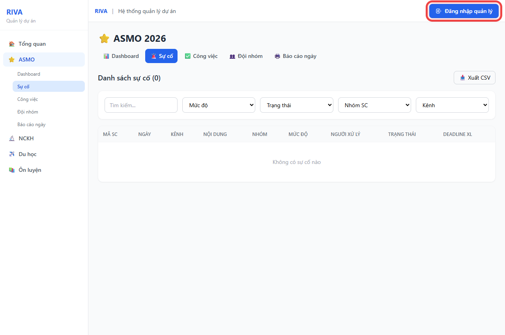
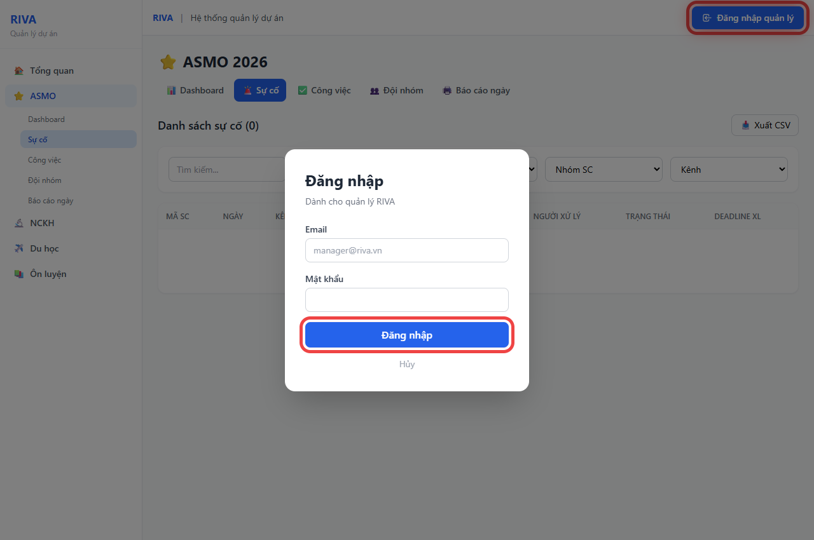
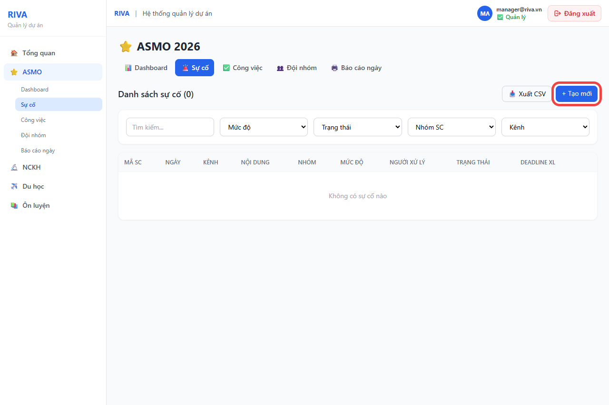
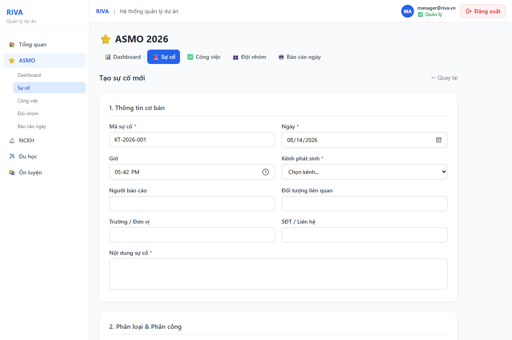

# Hướng Dẫn Vận Hành & Cập Nhật Sự Cố - Phân Hệ RIVA ASMO

Tài liệu cẩm nang hướng dẫn chi tiết quy trình thao tác từ khâu **Đăng nhập**, **Khai báo mới**, **Quy tắc đặt mã sự cố**, đến khâu **Cập nhật & Xử lý sự cố** trên hệ thống **RIVA Project Management (Phân hệ ASMO Incidents)**.

🌐 **Địa chỉ hệ thống web**: [https://riva-thong-tin-du-an.vercel.app/asmo/incidents](https://riva-thong-tin-du-an.vercel.app/asmo/incidents)

---

## 📋 MỤC LỤC

1. [Tổng quan Phân hệ ASMO Incidents](#1-tổng-quan-phân-hệ-asmo-incidents)
2. [Phân quyền Người dùng & Quy định Đăng nhập](#2-phân-quyền-người-dùng--quy-định-đăng-nhập)
3. [Quy tắc Đặt tên Mã Sự cố (`kênh_năm_tháng_ngày`)](#3-quy-tắc-đặt-tên-mã-sự-cố-kênh_năm_tháng_ngày)
4. [Khâu 1: Hướng dẫn Đăng nhập Quản lý](#4-khâu-1-hướng-dẫn-đăng-nhập-quản-lý)
5. [Khâu 2: Hướng dẫn Tạo mới & Khai báo Sự cố](#5-khâu-2-hướng-dẫn-tạo-mới--khai-báo-sự-cố)
6. [Khâu 3: Hướng dẫn Cập nhật Tiến độ & Xử lý Sự cố](#6-khâu-3-hướng-dẫn-cập-nhật-tiến-độ--xử-lý-sự-cố)
7. [Khâu 4: Xem Chi tiết, Tìm kiếm, Lọc & Xuất báo cáo CSV](#7-khâu-4-xem-chi-tiết-tìm-kiếm-lọc--xuất-báo-cáo-csv)
8. [Tiêu chuẩn SLA & Cảnh báo Trễ hạn](#8-tiêu-chuẩn-sla--cảnh-báo-trễ-hạn)
9. [Hướng dẫn Dành cho Nhà phát triển (Developer Guide)](#9-hướng-dẫn-dành-cho-nhà-phát-triển-developer-guide)

---

## 1. TỔNG QUAN PHÂN HỆ ASMO INCIDENTS

Phân hệ **ASMO Incidents** thuộc hệ thống RIVA giúp tiếp nhận, phân loại, phân công và kiểm soát toàn bộ vòng đời xử lý sự cố phát sinh từ khách hàng, đối tác và nội bộ dự án ASMO.

### Các tính năng chính:

- **Tự động hóa SLA**: Tính toán deadline Phản hồi & Deadline Xử lý dựa theo cấp độ khẩn cấp (P1 - P4).
- **Tự động sinh Mã Sự cố**: Mã định dạng `[KÊNH]_[NĂM]_[THÁNG]_[NGÀY]_[STT]`.
- **Cảnh báo sự cố Quá hạn / P1**: Hiển thị viền đỏ nhấp nháy cho sự cố mức độ P1 và cảnh báo biểu tượng `⚠️` khi quá hạn deadline.
- **Xuất dữ liệu**: Xuất báo cáo danh sách sự cố ra file Excel/CSV theo thời gian thực.

---

## 2. PHÂN QUYỀN NGƯỜI DÙNG & QUY ĐỊNH ĐĂNG NHẬP

Hệ thống RIVA phân chia 2 nhóm quyền sử dụng:

| Nhóm người dùng                     | Quyền hạn            | Thao tác được phép                                                                                                                      |
| :-------------------------------------- | :--------------------- | :------------------------------------------------------------------------------------------------------------------------------------------- |
| **Chưa đăng nhập (Public)**   | Xem & Tra cứu         | - Xem danh sách sự cố- Xem chi tiết từng sự cố- Lọc, tìm kiếm & Xuất CSV                                                          |
| **Quản lý (Đã đăng nhập)** | Toàn quyền (Manager) | - Đầy đủ quyền Xem-**Tạo sự cố mới (+)**- **Chỉnh sửa / Cập nhật tiến độ (✏️)**- **Xóa sự cố (🗑️)** |

---

## 3. QUY TẮC ĐẶT TÊN MÃ SỰ CỐ (`kênh_năm_tháng_ngày`)

Mã sự cố được hệ thống **tự động sinh chuẩn hóa** khi tạo mới dựa trên **Kênh phát sinh** và **Ngày tiếp nhận** theo công thức:

$$
\text{Mã Sự Cố} = \text{[TÊN\_KÊNH]}\_\text{[YYYY]}\_\text{[MM]}\_\text{[DD]}\_\text{[STT]}
$$

### Trong đó:

- **`[TÊN_KÊNH]`**: Tên kênh viết hoa không dấu (ví dụ: `EMAIL`, `ZALO`, `FANPAGE`, `DIENTHOAI`, `SALE`).
- **`[YYYY]_[MM]_[DD]`**: Năm, Tháng, Ngày tiếp nhận sự cố (ví dụ: `2026_08_14`).
- **`[STT]`**: Số thứ tự sự cố trong ngày của kênh đó, gồm 3 chữ số (`001`, `002`, `003`...).

### Ví dụ minh họa:

- Sự cố kênh **Zalo** ngày **14/08/2026** thứ 1 $\rightarrow$ **`ZALO_2026_08_14_001`**
- Sự cố kênh **Email** ngày **14/08/2026** thứ 1 $\rightarrow$ **`EMAIL_2026_08_14_001`**
- Sự cố kênh **Zalo** ngày **14/08/2026** thứ 2 $\rightarrow$ **`ZALO_2026_08_14_002`**

---

## 4. KHÂU 1: HƯỚNG DẪN ĐĂNG NHẬP QUẢN LÝ

### Bước 1: Mở giao diện Đăng nhập

Tại góc trên cùng bên phải của thanh **TopBar**, nhấn vào nút **`Đăng nhập quản lý`** *(được khoanh khung đỏ viền bên dưới)*:

---

### Bước 2: Nhập thông tin tài khoản

Cửa sổ **Modal Đăng nhập** xuất hiện:

1. Nhập **Email**: `manager@riva.vn`
2. Nhập **Mật khẩu**: `1234`
3. Nhấn nút **`Đăng nhập`** *(khoanh khung đỏ)* để xác thực.

---

### Bước 3: Xác nhận trạng thái Đăng nhập thành công

Sau khi đăng nhập thành công:

- Thanh TopBar hiển thị biểu tượng **`✅ Quản lý`** cùng Email cá nhân.
- Nút **`+ Tạo mới`** sự cố xuất hiện ở danh sách sự cố.
- Cột thao tác **Sửa / Xóa** xuất hiện trong bảng.

---

## 5. KHÂU 2: HƯỚNG DẪN TẠO MỚI & KHAI BÁO SỰ CỐ

### Bước 1: Nhấn nút Tạo mới

Tại màn hình Danh sách sự cố, nhấn nút **`+ Tạo mới`** *(khoanh khung đỏ ở hình trên)* hoặc truy cập đường dẫn `/asmo/incidents/new`.

---

### Bước 2: Điền form khai báo 5 phân đoạn

Form khai báo tạo mới sự cố gồm **5 phần chính**:

#### 1. Thông tin cơ bản:

- **Mã sự cố**: Hệ thống tự động sinh theo dạng `kênh_năm_tháng_ngày_stt` (VD: `ZALO_2026_08_14_001`).
- **Ngày / Giờ**: Chọn ngày giờ phát sinh sự cố.
- **Kênh phát sinh** *(Bắt buộc)*: Chọn `Email`, `Zalo`, `Fanpage`, `Điện thoại` hoặc `Sale`. (Thay đổi kênh sẽ tự cập nhật lại Mã SC).
- **Người báo cáo, Trường/Đơn vị, SĐT**: Thông tin đối tượng phản ánh.
- **Nội dung sự cố** *(Bắt buộc)*: Mô tả chi tiết vấn đề gặp phải.

#### 2. Phân loại & Phân công:

- **Nhóm sự cố** *(Bắt buộc)*: Chọn nhóm phù hợp:
  - `KT` – Kỹ thuật | `DK` – Đăng ký | `TK` – Tài khoản | `DATA` – Dữ liệu
  - `TT` – Truyền thông | `TC` – Tài chính | `KH` – Khiếu nại | `KHAC` – Khác
- **Mức độ ưu tiên** *(Bắt buộc)*:
  - `P1` 🔴 Khẩn cấp (SLA Phản hồi 15p, Xử lý 2h)
  - `P2` 🟠 Cao (SLA Phản hồi 30p, Xử lý 4h)
  - `P3` 🟡 Trung bình (SLA Phản hồi 2h, Xử lý 24h)
  - `P4` 🟢 Thấp (SLA Phản hồi 4h, Xử lý 48h)
- **Người phụ trách xử lý**: Chọn nhân sự phụ trách chính từ danh sách đội ngũ (`HÀ`, `HÒA`, `HƯỜNG`, `NGÂN`, `NAM`, `VÂN ANH`, `DŨNG`, `SƠN`, `ÁNH-NHI-PHƯƠNG`).

#### 3. SLA (Tự động tính):

- Hệ thống tự động tính toán **Deadline phản hồi** và **Deadline xử lý** dựa trên mốc *Thời điểm tiếp nhận* và *Mức độ ưu tiên (P1-P4)*.

#### 4. Xử lý ban đầu:

- **Trạng thái**: Chọn `Tiếp nhận` (mặc định).
- **Phương án xử lý**: Ghi nhận hướng xử lý dự kiến.

#### 5. Nguyên nhân & Phòng ngừa:

- Điền các thông tin bổ sung nếu có.

---

### Bước 3: Hoàn tất tạo mới

Nhấn nút **`Tạo sự cố`** *(khoanh khung đỏ ở cuối form)* để lưu vào cơ sở dữ liệu.

---

## 6. KHÂU 3: HƯỚNG DẪN CẬP NHẬT TIẾN ĐỘ & XỬ LÝ SỰ CỐ

Khi sự cố có tiến triển hoặc hoàn tất xử lý, Quản lý tiến hành cập nhật thông tin theo các bước:

### Bước 1: Mở form Chỉnh sửa Sự cố

Có 2 cách để mở form chỉnh sửa:

- **Cách 1**: Tại trang **Danh sách sự cố**, nhấn nút **`Sửa`** tại cột thao tác bên phải của sự cố tương ứng.
- **Cách 2**: Tại trang **Xem chi tiết sự cố**, nhấn nút **`✏️ Chỉnh sửa`** *(khoanh khung đỏ)*:

---

### Bước 2: Cập nhật các trường thông tin xử lý

Khi sự cố đang tiến hành hoặc đã xử lý xong, cập nhật các mục sau:

1. **Thay đổi Trạng thái sự cố**:
   - `Tiếp nhận` $\rightarrow$ `Đang xử lý` $\rightarrow$ `Chờ phản hồi` $\rightarrow$ `Hoàn thành` (hoặc `Đã hủy`).
2. **Cập nhật Phương án & Kết quả**:
   - **Phương án xử lý**: Mô tả các bước đã triển khai khắc phục.
   - **Kết quả xử lý**: Ghi rõ kết quả sau khi khắc phục xong.
3. **Mốc thời gian & Người xác nhận**:
   - **Thời điểm hoàn thành**: Chọn ngày giờ thực tế hoàn thành sự cố.
   - **Người xác nhận**: Chọn nhân sự xác nhận nghiệm thu kết quả.
4. **Phân tích Nguyên nhân & Phòng ngừa**:
   - **Nguyên nhân cốt lõi**: Điền nguyên nhân gốc rễ dẫn đến sự cố.
   - **Hành động phòng ngừa**: Đề xuất giải pháp tránh tái diễn.

---

### Bước 3: Lưu thay đổi

Nhấn nút **`Lưu thay đổi`** để hoàn tất cập nhật. Hệ thống sẽ báo hiệu thông báo xanh *"Đã cập nhật sự cố"*.

---

## 7. KHÂU 4: XEM CHI TIẾT, TÌM KIẾM, LỌC & XUẤT BÁO CÁO CSV

### 1. Xem Chi tiết Sự cố

Tại bảng danh sách, nhấp trực tiếp vào **Mã sự cố** (ví dụ: `ZALO_2026_08_14_001`) để chuyển sang màn hình xem toàn bộ 5 phần thông tin chi tiết.

### 2. Bộ lọc & Tìm kiếm đa chiều

Thanh lọc ở trên cùng của danh sách hỗ trợ:

- **Khung tìm kiếm**: Nhập mã SC, tên người báo cáo, đơn vị hoặc nội dung.
- **Dropdown lọc theo**: Mức độ (P1-P4), Trạng thái, Nhóm SC, Kênh phát sinh.
- **Nút "Xóa bộ lọc"**: Xóa toàn bộ điều kiện lọc để quay lại danh sách ban đầu.

### 3. Xuất file Báo cáo CSV

Nhấn nút **`📥 Xuất CSV`** ở góc phải header danh sách để tải về file Excel/CSV chứa toàn bộ dữ liệu sự cố đang hiển thị theo bộ lọc.

---

## 8. TIÊU CHUẨN SLA & CẢNH BÁO TRỄ HẠN

### Bảng Quy Định SLA Chi Tiết:

|  Mức độ  |  Nhãn & Màu  | Thời gian Phản hồi SLA |  Thời gian Xử lý SLA  | Cảnh báo thị giác                                 |
| :----------: | :------------: | :-----------------------: | :-----------------------: | :---------------------------------------------------- |
| **P1** | 🔴 Khẩn cấp |    **15 phút**    |  **2 giờ (120p)**  | Dòng có nền đỏ nhạt + Chấm đỏ nhấp nháy 🔴 |
| **P2** |     🟠 Cao     |    **30 phút**    |  **4 giờ (240p)**  | Huy hiệu màu cam 🟠                                 |
| **P3** | 🟡 Trung bình |  **2 giờ (120p)**  | **24 giờ (1440p)** | Huy hiệu màu vàng 🟡                               |
| **P4** |    🟢 Thấp    |  **4 giờ (240p)**  | **48 giờ (2880p)** | Huy hiệu màu xanh 🟢                                |

### Nhận biết Sự cố Quá Hạn (Overdue):

- Sự cố chưa ở trạng thái `Hoàn thành` hoặc `Đã hủy` và đã vượt quá **Deadline xử lý** sẽ tự động hiển thị **viền đỏ đậm ở lề trái** bảng và thêm biểu tượng cảnh báo **`⚠️`** cùng mốc thời gian in đỏ.

---

*Tài liệu được cập nhật tự động theo phiên bản mới nhất của hệ thống RIVA ASMO.*
